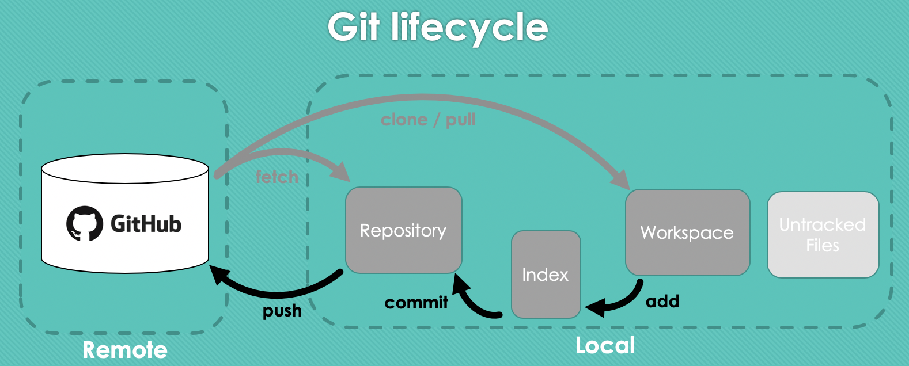
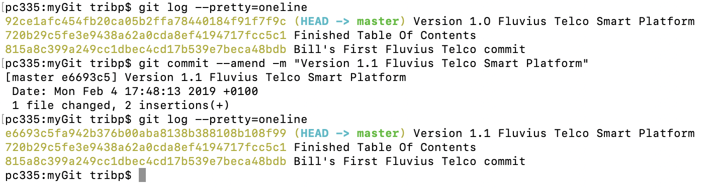
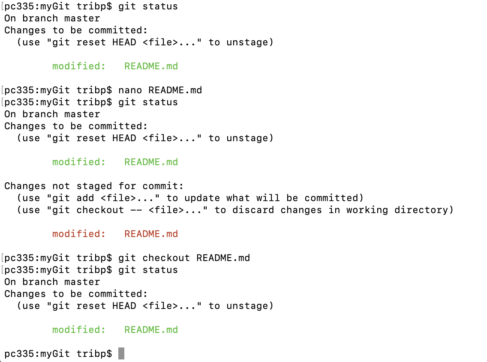

# Git and GitHub

TOC:

- 1 Intro
- 2 Basic Git Commands
- 3 Remote Repository
- 4 Branching
- 5 Merge and Rebase



**References:**

- must read: extensive but very clear: https://git-scm.com/book/en/v2
- Good quick intro: Youtube 'freeCodeCamp': https://www.youtube.com/watch?v=vR-y_2zWrIE&list=PLWKjhJtqVAbkFiqHnNaxpOPhh9tSWMXIF
- Git workshop from cs50 so ...Top!: https://www.youtube.com/watch?v=MJUJ4wbFm_A

# 1 Intro

**Important**: use CLI and not GUI when learning Git

### Principles:

- git is a VCS = "Version Control System"
- git takes 'snapshots' and NOT 'differences' as other VCS's -> Git = Fast
- Every 'snapshot' has a unique id (SHA-1)
- Git is a 'distributed system' -> so can work 'offline'
- git = VCS and GitHub is a webservice offering a 'git platform'
- git 'public' = free and git 'private' = \$
- all git info sits in the '.git' folder created by 'git init' <br> <br>


# 2 Basic Git Commands

```
- git init              -> Initialize this folder as a Git Repo
- git add <file>        -> 'add' (or index) this file to the index ('stage it')
- git status            -> check status of working tree
- git commit            -> 'commit' changes in the index (= staging area)
- git push              -> push to the remote repository
- git clone             -> clone Repo into a new directory
- git pull              -> pull(+merge) 'latest' from remote to local repo
- git fetch             -> get all remote changes into the local directory
```

### 2.1 First configure your settings

```
- git init
- git config user.name 'Bill Gates'
- git config user.email 'bill.gates@fluvius-net.be'
```

_Remark:_

- git config --system -> applied to 'all users / directories'
- git config --global -> applied to 'you / all directories'
- git config --local -> applied to 'you / this directory' (default)

_Add a file to the staging area._

```
- git add index.html
- git status
```

<br>


_Remark:_ 'git add .' will add all files from the current directory.

```
git status -s
```


_Remark 2 columns:_

- Left = Staging area ('add').
- right = working tree (your 'working directory')

Now we will edit, thus modify, the README.md file, who was already staged ('add') and see the result if we look at the status again. (see below: A became AM)


Removing a file from the staging area.

```
- git rm --cached index.html      -> --staged = --cached => 'synonyms'
```

### 2.2 Ignore some files

Sometimes you don't want certain files, eg. artefacts of your building proces, to be part of your repository. To exclude certain file or file types, you get define them in '.gitignore'.

```
cat .gitignore
*.[oa]          -> exclude all files ending on '.a' / '.o'
*~              -> exclude all files ending on '~' (temp files in certain programs)
```

other syntax or wildcards:

- \*.c -> exclude all files with extension 'c'
- !main. -> excplicitly include this file
- /garbage -> exclude this subdir
- doc/\*.txt ->exclude all txt files in this dir.

### 2.3 Viewing your 'staged' and 'unstaged' changes

To see the 'detailed' differences of what you:

- changed but not yet staged: 'git diff'
- stagged but not yet commited: 'git diff --stagged' (or --cached)

Below we did 'git diff', telling us what we changed but not yet staged ('git add'), and see we added a empty line + some text 'This is some new text'.


### 2.4 Committing

```
- git commit              -> return text editor for adding comments (+ git diff info)
- git commit . -m "My first commit"   -> "quiclky provide your small comment"
- git commit -v           -> adds detailed changes (= diff output)
```

Remark: You can skip the 'staging' and 'commit' directly by adding '-a'. This way Git will automaticly stage every file that is already 'tracked' by Git.

```
- git commit -a -m "staging + commit of all tracked files"
```

### 2.5 Removing files

Suppose we staged and commited 'brol.txt'

```
- git rm brol.txt  -> deletes the file in working dir + staging + commited
- git rm --cached brol.text -> leaves the file in the working dir but 'untracked'
- git rm \*.txt         -> deletes+un-stage+un-commit of all txt file
- git rm images/\*.jpg  -> idem in folder 'images'
```

### 2.6 Moving files

```
- git mv version1.txt version2.txt
```

But what git is doing is :

```
mv version1.txt version2.txt
git rm version1.text
git add version2.txt
```

### 2.7 Viewing Commit History

```
- git log
- git log -p -2     -> -p = include differences -2 = max 2 entries
- git log --stat
- git log --pretty=oneline
```


### 2.8 Undoing ...

#### Undoing a commit

**3 options: soft/mixed/hard**

- **hard** = deletes everything from the actual workspace.
- **mixed** = deletes only staged files frolm the actual workspace
- **soft** = takes all the files to former commit workspace.


```
- git reset --hard HEAD~1     -> deletes 1 commit from the HEAD pointer
```

**Example:** We have 2 commits, the first contains 1 file(README.md) and the second commit 2 files (README.md+index.html).<br>We wil perform a 'hard reset', deleting the last commit, including all files from the actual workspace. The result is the situation of the first commit as if the second one never happened.


### Undoing the commit message

**Scenario 1:** Just after a commit your forgot some files or uesed wrong message.

example: we made an error in the commit message and want to correct this.

```
- git commit -m "version 1.0"
```

To correct this (see below) but the commit will only get a new sha1.

```
- git commit --amend -m "version 1.1"
```



### Undoing staged files

Tip: 'git status' gives you a hint how.

Scenario: we 'staged' all files, including index.html' (git add) but we want to undo it.


### Undoing a modified file

Tip: 'git status' gives you a hint how.

Scenario: we already 'staged' README.md, the we made new changes and also staged them, but we want to undo this last stage.



## 3 Remote repository

Stricktly speaking you have 3 choices but practicaly only 1.

    1) you do not use a remote one, not even locally (nobody does this)
    2) you use one, but locally on your machine (almost nobody)
    3) you use a 'cloud based git platform' (like GitHub, GitLab,Bitbucket, etc)

The third choice is the most evident choice. Once you made this choice, you have 2 options:

    - a 'Public' repo = free and open to the world.
    - a 'Private' repo = subscription, ideal for internal company use.

Remember that git is not only ideal for 'coding' projects but also for documentation, tutorials or lab cookbooks.

### 3.0 Command Summary

**Getting Data**

```
- git clone <url>       ->copies remote repo to local/makes dir/git already
- git pull              -> = fetch + merge (scenario when already working repo)
- git fetch             -> = only gets remote changes without merging the local files (very safe)
```

**Pushing Data**

```
git push
```

Typically you will see something like:

```
- git push origin master
```

- origin = (default) name of your remote location (endpoint)
- master = name of the 'branch' you push on.

### 3.1 Scenario 1:

Suppose you have started a project on your local machine and now want to share is with the rest of the world on GitHub.

#### 3.1.1 Create a GitHub Repo

- create a account on Github
- create a Repository within your GitHub account

#### 3.1.2 Prepare your local Repo

```
- git config --local credential.helper ""   -> forces uses local user+pswd (otherwise global user if different)
- git remote add origin https://github.com/fluvius-net/Git-Getting-Started.git

```

_Remark_: If you don't to be prompted every time for your login/pswd, you can cache it for a few minutes

```
- git config --local credential.helper --cache
```

Check your homework

```
- git remote -v
- git config --list
- git config -l | grep url
```

#### 3.1.3 Push your Repo to GitHub

```
- git push -u origin master
```

Alternatively, you can use **'git push --force origin master'** We need to use **'--force'** because the remote repo, uptil now, has now clue of our existance and are not in sync.

Viewing the tree

```
- git log --all --decorate --oneline --graph
- alias = "git log --all --decorate --oneline --graph"

```

## 4 Branching

#### HEAD pointer

The HEAD pointer is a very important concept and indicates the current branch and commit you are working on. (see ' \* ' in the console)

### 4.0 Commands

```
- git branch dev      -> creates new branch named 'dev' but does no 'checkout'
- git checkout dev    -> switch to dev branch
- git branch          -> shows all branches + actual one
- git log --all --decorate --oneline --graph

```

**Important**:

- ! when 'checking out' (=changing) branch, you must have a 'clean' state. (= everything is 'commited')

**Typical workflow:**

- master
- dev
- bugfix or topics

### 4.1 The 'happy flow'

By happy flow we mean that before executing 'git checkout OtherBranch', you have 'committed' everything and thus having a 'clean' workspace. In a lot of situations this will not be the case. Suppose your are in the middle of your work and all of a sudden you need to leave it and work on something else first.

For the latter, you have two choices, or deleting your unfinished work or 'stashing it' (see further), this means saving it and setting it aside.

### 4.1 Stash or in case of unfinished work.

You don't want to commit but prefer to save or stash your work in progress.

```
- git stash save "Busy working on xxx"
```

Show me the list of my saved stashes

```
- git stash list
```

Replace my work in progress and apply the appropriate 'backup'

```
- git stash apply stash@{1}
```

## 5 Merge & Rebase

In git there are 2 main options to integrate changes from 2 branches:

- Merge
- Rebase

### 5.1 Merge:

**There are 2 merge possibilities:**


### 5.1.1 Fast Foreward merge

- only when there is a LINEAR relation between the 2 commits.
- no new commit is created.

### 5.1.2 3-way merge

- when there is NO LINEAR relation between the 2 commits.
- a new commit is created.

[See detailed workflow example](doc/git.pdf)

### 5.2 Rebase:

As the word indicates, it 'moves' the base of a branch foreward. Go to the branch you want to rebase, the apply the command.

```
- git checkout dev
- git rebase master
```


**Warning:** Do NOT rebase commits that exists outside your local repository.
